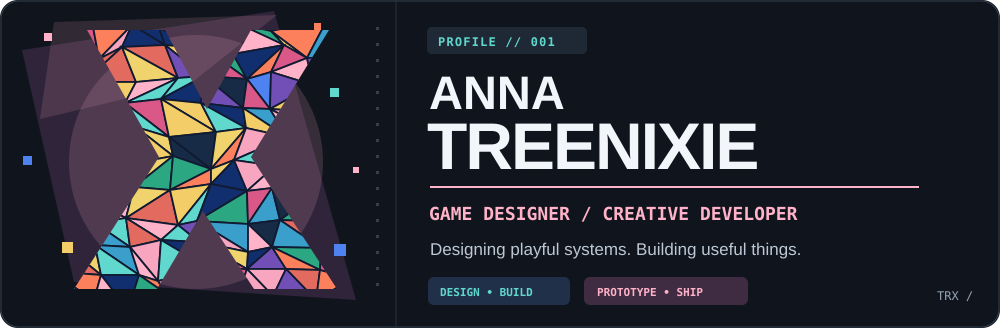
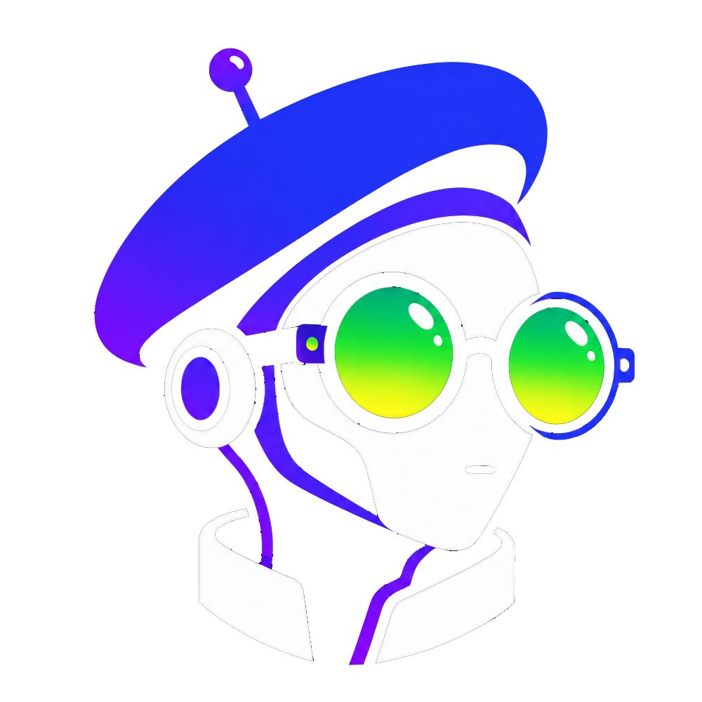

  

<table>
<tr>
<td width="34%" valign="top">
  <h3>01 / GAME DESIGN</h3>
  
Gameplay systems, interactive prototypes, and player experience.

</td>
<td width="33%" valign="top">
  <h3>02 / DEVELOPMENT</h3>
  
Digital products, apps, and community automation.

</td>
<td width="33%" valign="top">
  <h3>03 / CREATIVE TECH</h3>
  
AR experiences, interactive design, and experimental ideas.

</td>
</tr>
</table>

## Selected work

<table>
<tr>
<td width="50%" valign="top" align="center">
  
  <h3>Cervantes</h3>
  
<strong>Community tools / Discord automation</strong>

  
Modular systems for multi-guild communities, from permissions to moderation and automation.

  
TYPE SCRIPT &nbsp; · &nbsp; DISCORD.JS &nbsp; · &nbsp; POSTGRESQL

</td>
<td width="50%" valign="top" align="center">
  
  <h3>Avelea</h3>
  
<strong>Thoughtful mobile experience</strong>

  
A lightweight personal tracker with a focus on clear interactions and everyday usability.

  
FLUTTER &nbsp; · &nbsp; DART &nbsp; · &nbsp; MOBILE UX

</td>
</tr>
</table>

Both products are in development. Source code may be private until release.

## Language footprint

  

Aggregated source-file sizes from accessible active repositories; refreshed daily by GitHub Actions. No source code is published in this chart.

## GitHub activity / Tetris

<!-- Tetris: original animation, theme switching and branch references are intentionally preserved. -->

  <picture>
    <source media="(prefers-color-scheme: dark)" srcset="https://raw.githubusercontent.com/Treenixie/Treenixie/visual/github-tetris-dark.svg">
    <source media="(prefers-color-scheme: light)" srcset="https://raw.githubusercontent.com/Treenixie/Treenixie/visual/github-tetris-light.svg">
    
  </picture>

Every contribution drops a piece. Bugs are complimentary.

