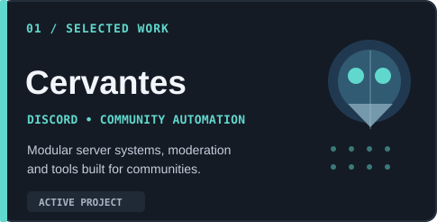
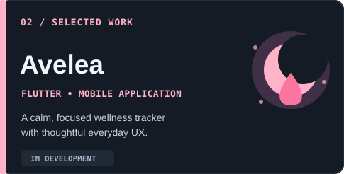
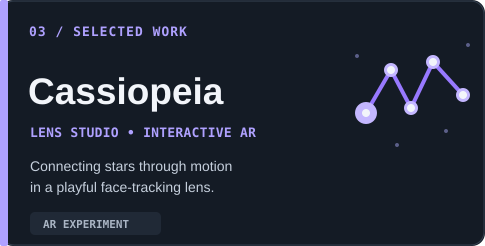
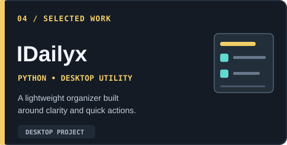
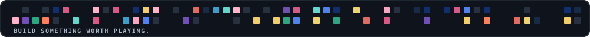

<div align="center">
  
</div>

<br>

<table>
<tr>
<td width="34%" valign="top">
  <h3>01 / GAME DESIGN</h3>
  <p>Gameplay systems, interactive prototypes, player experience, and experimentation.</p>
</td>
<td width="33%" valign="top">
  <h3>02 / DEVELOPMENT</h3>
  <p>Apps, Discord automation, and tools designed around real people's needs.</p>
</td>
<td width="33%" valign="top">
  <h3>03 / CREATIVE TECH</h3>
  <p>AR lenses, visual systems, and curious ideas worth prototyping.</p>
</td>
</tr>
</table>

<br>

## Selected work

<table>
<tr>
<td width="50%"></td>
<td width="50%"></td>
</tr>
<tr>
<td></td>
<td></td>
</tr>
</table>

*Some projects are in development or kept in private repositories. Public links and demos will be added as they become available.*

<br>

## Toolkit

| Design & creative | Development | Infrastructure |
| :-- | :-- | :-- |
| Game systems · UI/UX · Figma | Python · Dart / Flutter | Git · GitHub · Docker |
| Lens Studio · AR prototyping | JavaScript · TypeScript | PostgreSQL · Linux |

<br>

## GitHub activity / Tetris

<!-- Tetris: original animation, theme switching and branch references are intentionally preserved. -->
<p align="center">
  <picture>
    <source media="(prefers-color-scheme: dark)" srcset="https://raw.githubusercontent.com/Treenixie/Treenixie/visual/github-tetris-dark.svg">
    <source media="(prefers-color-scheme: light)" srcset="https://raw.githubusercontent.com/Treenixie/Treenixie/visual/github-tetris-light.svg">
    
  </picture>
</p>

<br>

## Currently exploring

```text
> design interactive systems that feel natural
> make useful tools feel delightful
> turn small experiments into finished products
```

<br>

<div align="center">
  
</div>
