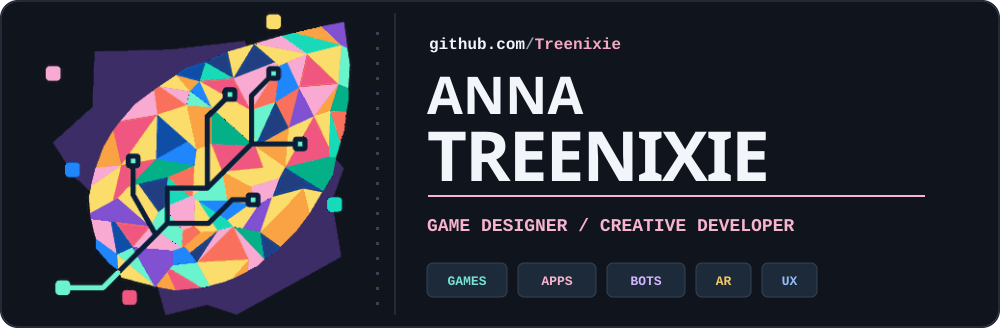
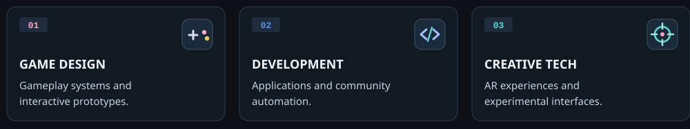
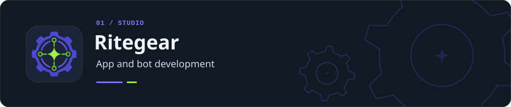
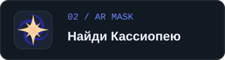

  

  

## Projects

  &emsp;&emsp;

## Language footprint

  

## GitHub activity / Tetris

<!-- Tetris: original animation, theme switching and branch references are intentionally preserved. -->

  <picture>
    <source media="(prefers-color-scheme: dark)" srcset="https://raw.githubusercontent.com/Treenixie/Treenixie/visual/github-tetris-dark.svg">
    <source media="(prefers-color-scheme: light)" srcset="https://raw.githubusercontent.com/Treenixie/Treenixie/visual/github-tetris-light.svg">
    
  </picture>

<!-- PROFILE_YEAR_START -->

2026

<!-- PROFILE_YEAR_END -->
